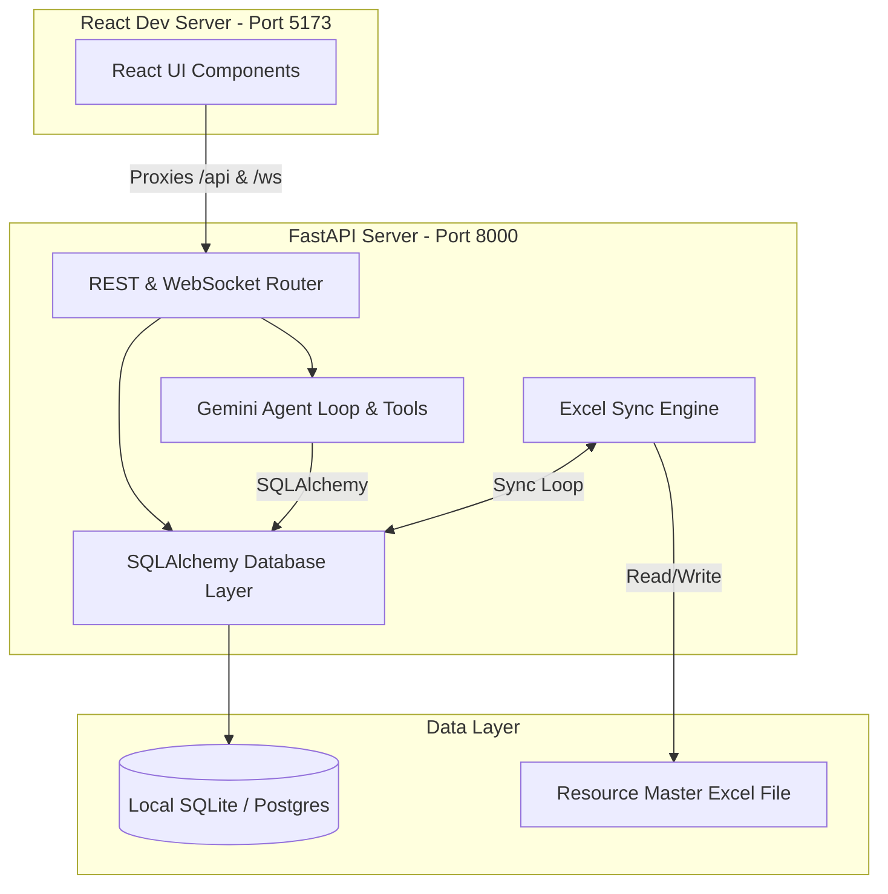

# Jazz Resource Platform

A production-friendly workforce management and sales pipeline platform built using a FastAPI backend and a React (Vite) frontend. The platform features an AI-powered chatbot (powered by Google Gemini) for query resolution, a robust Excel-based synchronization mechanism, and rich resource/sales pipeline dashboards.

---

## Architecture Overview



- **Frontend**: React 19, Vite, Vanilla CSS. Uses Vite dev server proxying for a seamless local development experience.
- **Backend**: FastAPI, Uvicorn, Pydantic, SQLAlchemy.
- **AI Engine**: Google Gemini API key-based generative loop utilizing Python client library tool calls to query and modify database entities.
- **Data Stores**: Local SQLite by default for development; fully configured for PostgreSQL in production.
- **Integration**: A background task periodically polls a source Excel file and synchronizes changes bidirectionally with the database.

---

## Local Setup & Quickstart

### Prerequisites
- **Python**: 3.10 or 3.11
- **Node.js**: 18+ and `npm`

### Environment Configuration
Copy the `.env.example` file to `.env` in the project root:
```bash
cp .env.example .env
```
Fill in your `GEMINI_API_KEY` (from [Google AI Studio](https://aistudio.google.com/)).

---

### Development Mode (Recommended)
We provide a Windows batch script to launch the backend and frontend simultaneously with a single command:
```cmd
run_dev.bat
```
This script will:
1. Initialize the backend python server on port `8000`.
2. Check for `node_modules` in `frontend/`, run `npm install` automatically if they are missing, and start the Vite dev server on port `5173`.
3. Open two command windows so you can easily view output and logs.

Once running, navigate to:
- **Frontend App**: `http://localhost:5173`
- **Backend API & Swagger Docs**: `http://localhost:8000/docs`
- **Health Check**: `http://localhost:8000/health`

*Note: In development, any changes made to the React code will instantly hot-reload in the browser without rebuilding the application, thanks to the Vite proxy configured in [vite.config.js](frontend/vite.config.js).*

---

### Production Mode (Local Run)
If you want to run the application exactly as it behaves in a production deployment, build the React app and start the server:

1. **Build the Frontend**:
   ```bash
   cd frontend
   npm install
   npm run build
   cd ..
   ```
2. **Start the FastAPI server**:
   ```bash
   venv\Scripts\python.exe -m uvicorn app.server:app --port 8000
   ```
Navigate to `http://localhost:8000` to view the compiled and served application.

---

## Running Automated Tests

We use `pytest` for the python test suite. To run the tests from the root workspace:
```bash
venv\Scripts\pytest
```

---

## Environment Variables Reference

| Variable | Description | Default |
| :--- | :--- | :--- |
| `GEMINI_API_KEY` | Google AI Studio key to power the AI chatbot. | *None (Required)* |
| `GEMINI_MODEL` | Gemini LLM variant to instantiate. | `gemini-3.5-flash` |
| `DATABASE_URL` | SQLAlchemy connection string. | `sqlite:///resource_platform.db` |
| `DISABLE_EXCEL_SYNC` | Set to `true` to disable Excel background polling and saves. | `false` |
| `EXCEL_PATH` | Override path to the synchronized resource Excel file. | `data/Teknosys_Resource_Management_Tool_SAMPLE.xlsx` |

---

## Deployment Guide

### Option 1: Render Deployment (Docker Blueprint)
The project includes a `Dockerfile` and `render.yaml` blueprint for one-click deployments.

1. Create an account on [Render](https://render.com/).
2. Click **New** -> **Blueprint**.
3. Connect your Git repository containing this codebase.
4. Render will automatically parse the `render.yaml` file, build the multi-stage Docker image, and launch the FastAPI server.
5. In the Render environment variables dashboard, specify:
   - `GEMINI_API_KEY`: *Your Google AI Studio Key*
   - `DATABASE_URL`: Set this if using an external database (e.g. Neon or Aiven PostgreSQL).

### Option 2: Docker Build (Any Cloud Provider)
You can build and run the application as a single Docker container on any host (AWS, GCP, Railway, Fly.io, etc.):

1. **Build the image**:
   ```bash
   docker build -t resource-platform .
   ```
2. **Run the container**:
   ```bash
   docker run -p 8000:8000 -e GEMINI_API_KEY="your-key" resource-platform
   ```
